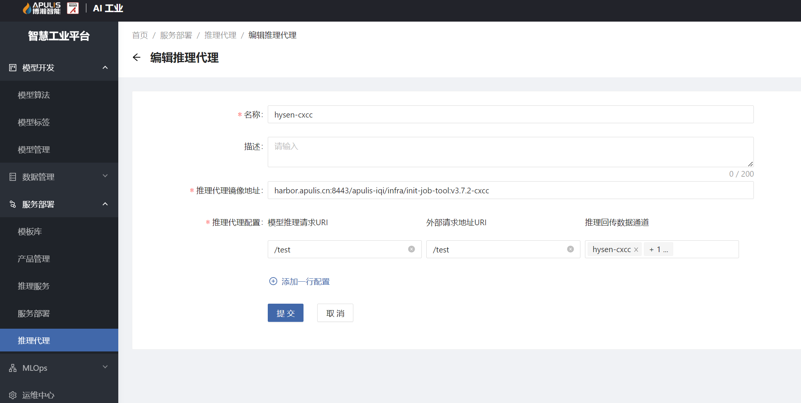
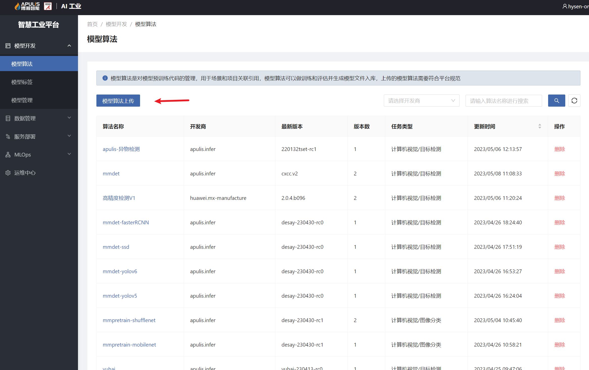
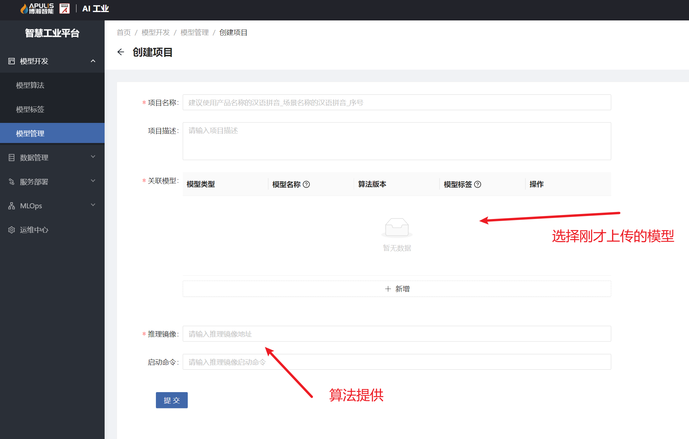
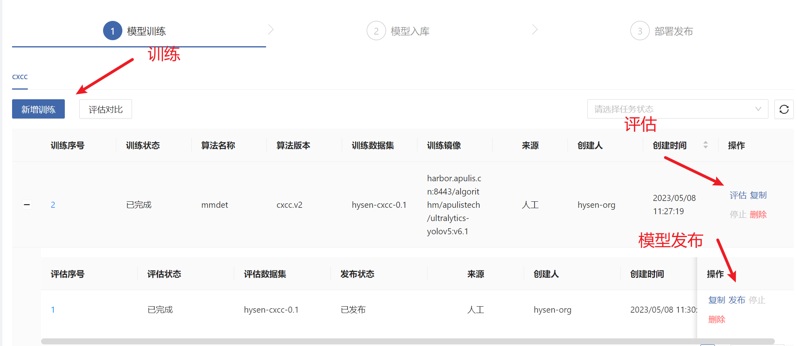
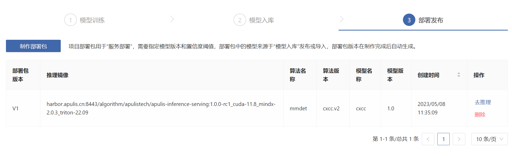
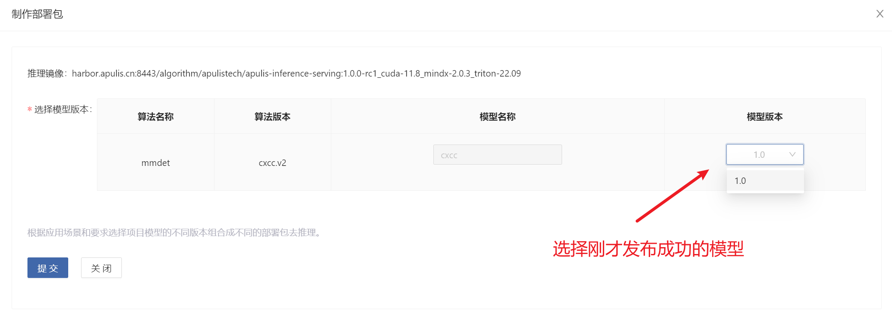

# 模型推理适配
## 模型适配步骤
### 创建推理代理
- 创建并启动 pg数据通道和图片通道，推理代理将保存推理数据以及图片分别存到这两个通道，如果已经存在通道则忽略该步骤

- init-job-tool 适配数据回传代码,并制作成推理代理镜像
  - harbor.apulis.cn:8443/apulis-iqi/infra/init-job-tool:v3.7.2-cxcc
- 创建推理代理，填入上面步骤创建好的数据通道

### 上传算法模型

### 创建项目

### 训练，评估，模型发布
- 数据集均由算法提供

### 部署发布-创建部署包

### 创建推理服务
- 选择 创建好的项目
- 选择 创建的部署包
- 选择 创建好的推理代理

### 推理测试
- 调用推理接口成功
- 检查数据通道查看数据及图片是否正常存储
- 以上检查均没问题，则推理适配成功